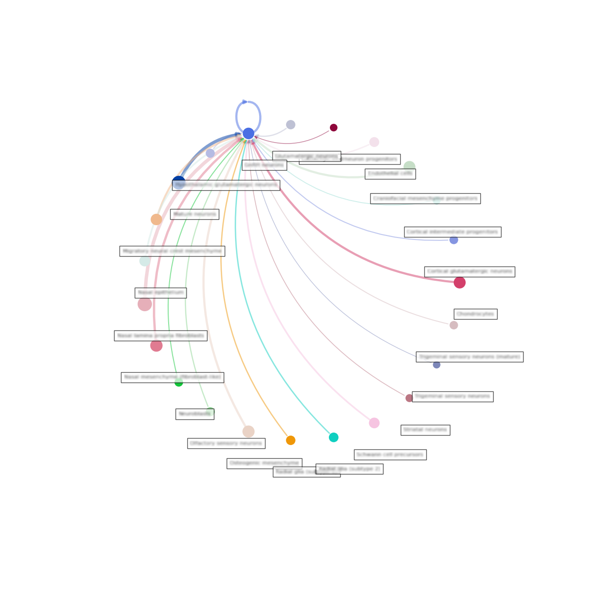
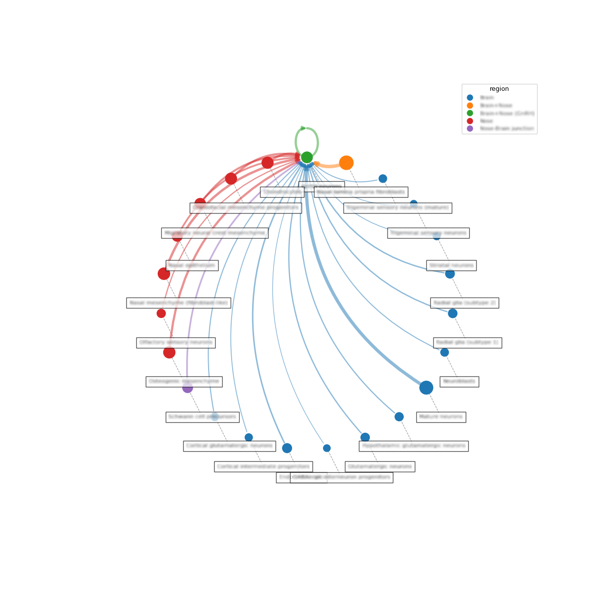
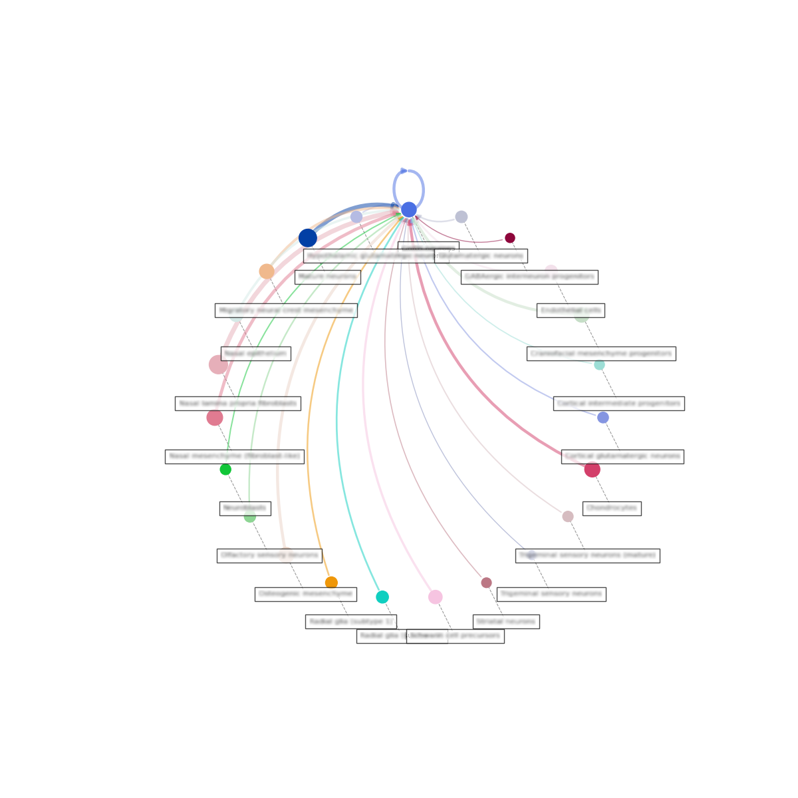
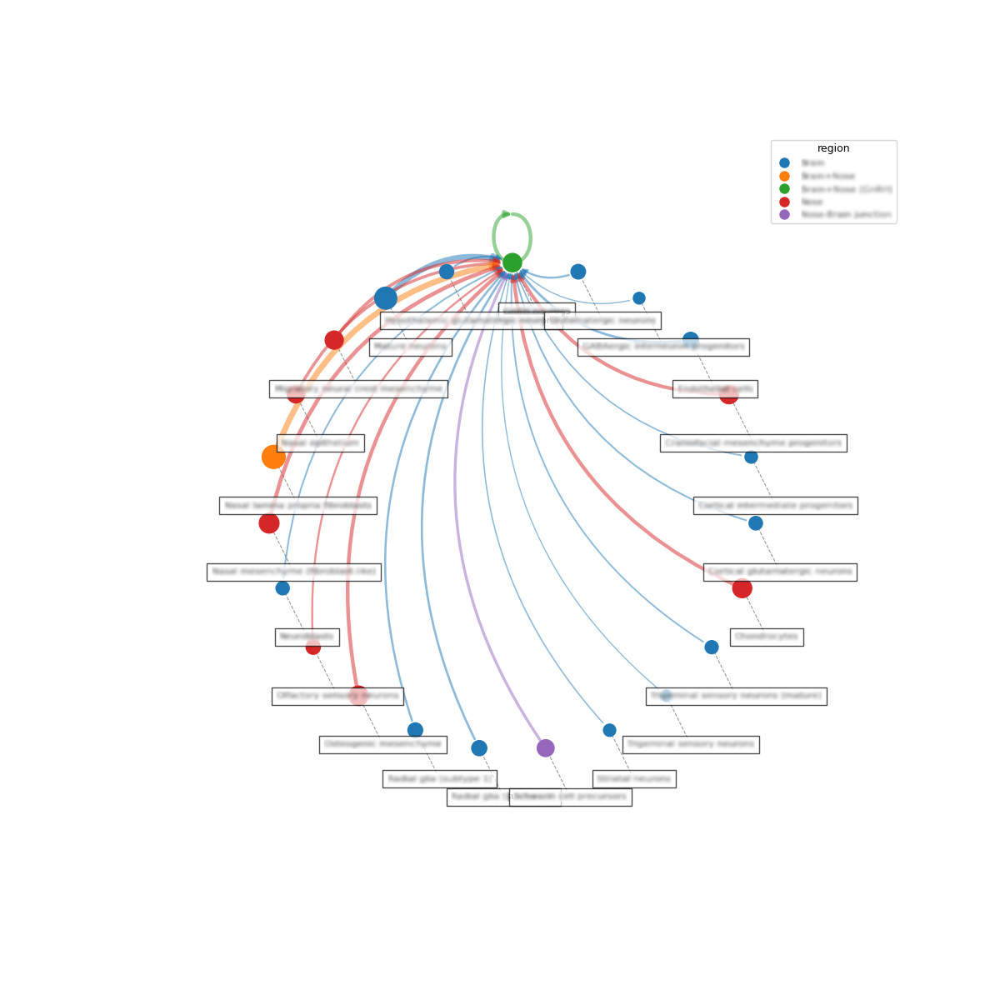
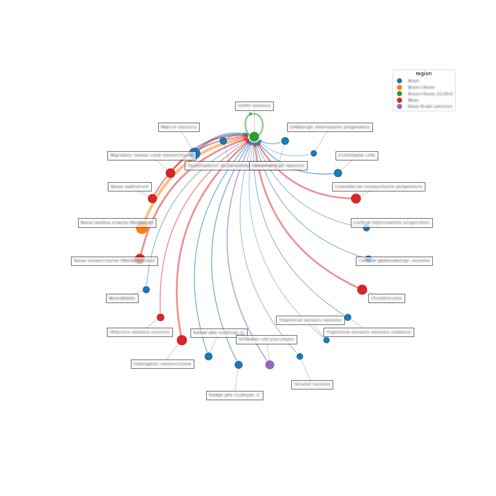
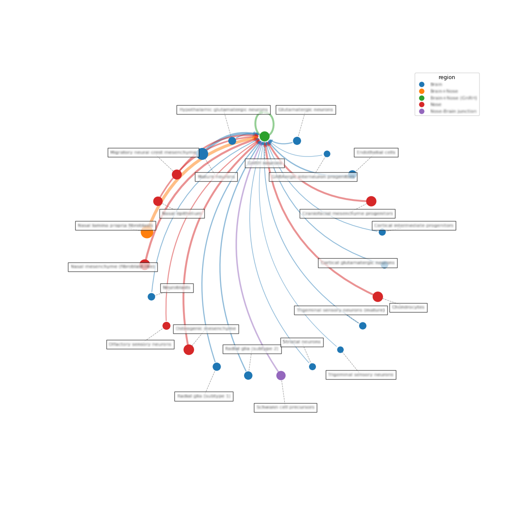
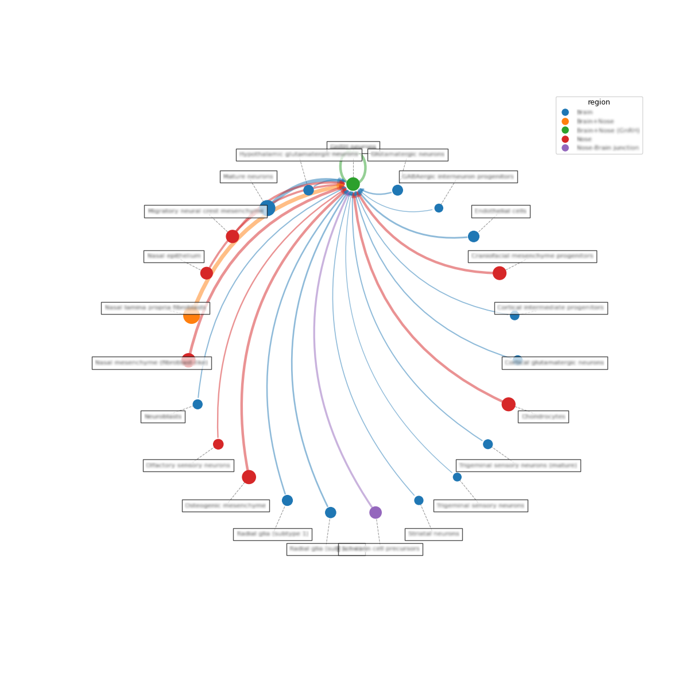
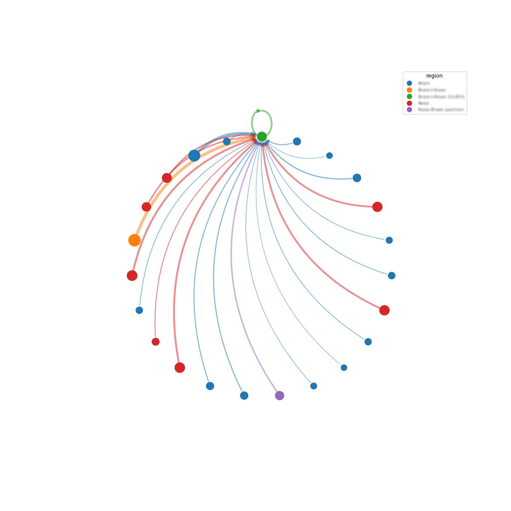

# single-cell-utils

Utility functions for single-cell transcriptomics analysis, developed during a bioinformatics internship at the Service of Endocrinology, Diabetology and Metabolism, CHUV (Lausanne University Hospital), Switzerland.

## Functions

| Function | Description |
|---|---|
| `find_leiden_resolution` | Iteratively adjusts Leiden resolution until the cluster count falls within a target range. |
| `find_all_markers` | Fast, Seurat/Scanpy-compatible marker detection using [illico](https://github.com/remydubois/illico), with optional pre-filtering and CSV export. |
| `circle_plot_extended` | Extended [LIANA+](https://github.com/scverse/liana) `circle_plot` with additional styling (node-label connector lines, additional key to color nodes by), node clustering, and label-placement options. |

Please see the source files for full signatures and docstrings.

## Dependencies

Developed against:

- Python >= 3.10
- [Scanpy](https://scanpy.org) 1.12.x
- [illico](https://github.com/remydubois/illico) 0.6.0
- [LIANA+](https://github.com/scverse/liana) 1.7.3

*(Versions reflect the tested environment; newer minor versions may work but are unverified.)*

## Extended Circle Plot Examples

> Note: All examples use the same data and `groupby`/`colorby` keys unless otherwise noted.

### Vanilla vs. Extended
<table>
<tr>
<td align="center"> <code>vanilla `circle_plot` (liana==1.7.3)</code></td>
<td align="center"> <code>extended (colorby="region", cluster_nodes=True)</code></td>
</tr>
</table>

### Label Placement
<table>
<tr>
<td align="center"> <code>colorby=None</code></td>
<td align="center"> <code>cluster_nodes=False, label_placement="manual"</code></td>
</tr>
<tr>
<td align="center"> <code>cluster_nodes=False, label_placement="hybrid"</code></td>
<td align="center"> <code>cluster_nodes=False, label_placement="alternating"</code></td>
</tr>
<tr>
<td align="center"> <code>cluster_nodes=False, label_placement="outward"</code></td>
<td align="center"> <code>cluster_nodes=False, label_placement=None</code></td>
</tr>
</table>

> Note: Node labels are blurred to protect unpublished data.